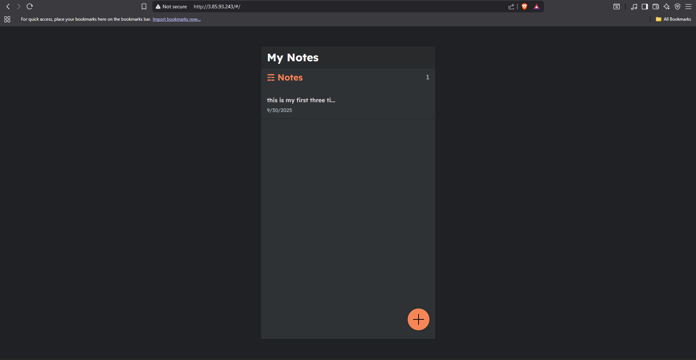
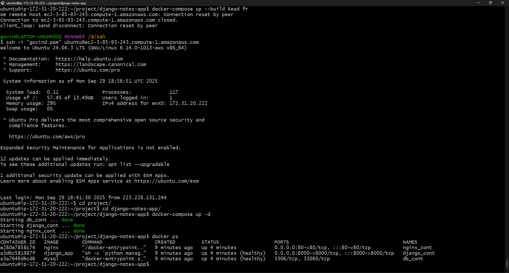

# Django Notes App 📝

A simple Django-based notes application containerized with **Docker** and orchestrated using **Docker Compose**.

---

## 🚀 Prerequisites

* Ubuntu 20.04+ (or compatible Linux system)
* `sudo` privileges
* Internet connection

---

## 🛠️ Installation

### 1. Install Docker

```bash
# Update packages
sudo apt update

# Install dependencies
sudo apt install apt-transport-https ca-certificates curl software-properties-common -y

# Add Docker’s official GPG key
curl -fsSL https://download.docker.com/linux/ubuntu/gpg | sudo apt-key add -

# Add Docker repository
sudo add-apt-repository \
   "deb [arch=amd64] https://download.docker.com/linux/ubuntu \
   $(lsb_release -cs) stable"

# Install Docker CE
sudo apt update
sudo apt install docker-ce -y

# Verify installation
docker --version
```

### 2. Install Docker Compose

#### Option A: (Docker Compose v2 – recommended)

```bash
sudo apt-get update
sudo apt-get install docker-compose-plugin -y

# Verify
docker compose version
```

#### Option B: (Legacy Docker Compose v1)

```bash
sudo curl -L "https://github.com/docker/compose/releases/download/1.29.2/docker-compose-$(uname -s)-$(uname -m)" -o /usr/local/bin/docker-compose

sudo chmod +x /usr/local/bin/docker-compose

# Verify
docker-compose --version
```

---

## 📂 Project Setup

Clone this repository:

```bash
git clone https://github.com/your-username/django-notes-app.git
cd django-notes-app
```

Your project structure should look like:

```
django-notes-app/
│── docker-compose.yml
│── Dockerfile
│── requirements.txt
│── manage.py
└── notes/   (Django app folder)
```

---

## ⚙️ Build & Run with Docker Compose

### Using Docker Compose v2:

```bash
docker compose up --build
```

### Using Docker Compose v1:

```bash
docker-compose up --build
```

> The `--build` flag ensures the image is rebuilt whenever you change code or dependencies.

---

## 📸 Screenshots

### 1. Deployment (Terminal View)



---

### 2. Output in Browser (Django Notes App)



---

## 🔍 Useful Commands

* Run in background:

  ```bash
  docker compose up -d     # or docker-compose up -d
  ```

* Stop containers:

  ```bash
  docker compose down      # or docker-compose down
  ```

* Rebuild without cache:

  ```bash
  docker compose build --no-cache
  ```

* Check logs:

  ```bash
  docker compose logs -f
  ```

---

## 🌐 Access the App

By default, the app runs on:

```
http://localhost:8000
```

If running on a remote server, replace `localhost` with your server’s public IP.

---

## 🧹 Cleanup

```bash
docker compose down -v
docker system prune -af
```

---

## ✅ Troubleshooting

* **Error: `unknown flag: --build`** → Use `docker-compose up --build` instead.
* **Permission denied** → Add your user to the Docker group:

  ```bash
  sudo usermod -aG docker $USER
  newgrp docker
  ```
* **App not loading** → Check logs:

  ```bash
  docker compose logs -f
  ```

---
